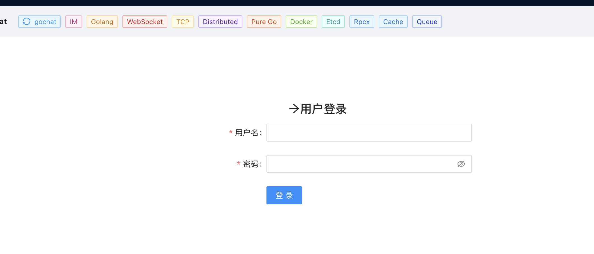
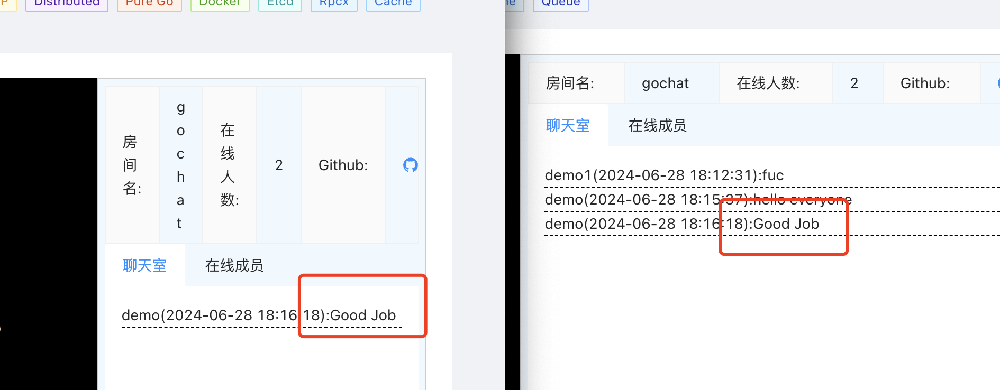
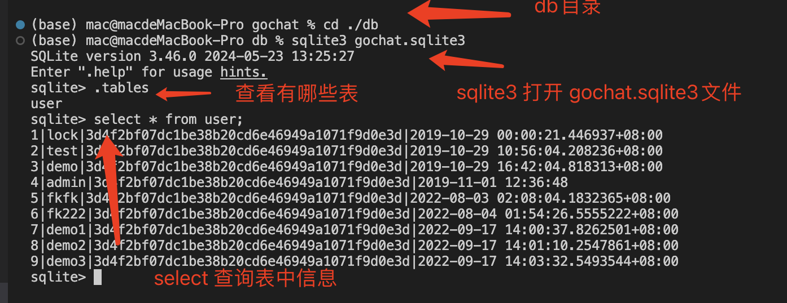
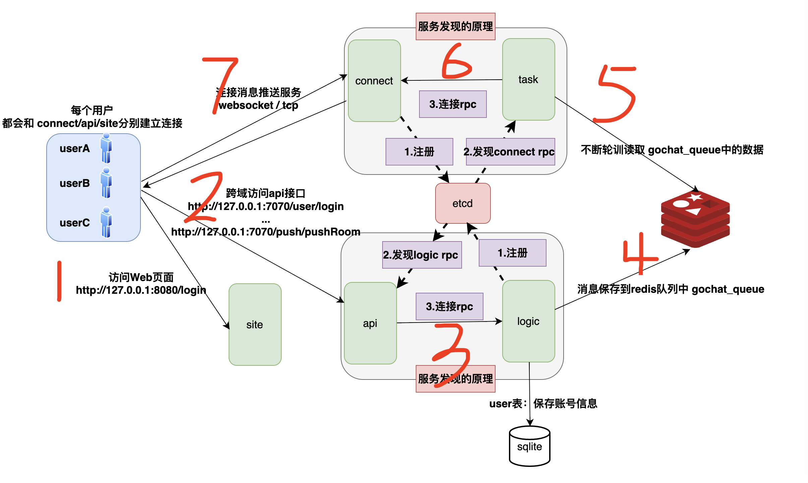

# Golang 实现轻量级IM

本项目教你如何从0-1实现一个的分布式系统。


## 前言
整个项目的效果类似于腾讯课堂，加入一个直播聊天室（发送消息 && 接收消息）

看代码的时候建议大家多关注技术细节（这个才是最通用的东西）：比如 tcp如何封包/拆包；http怎么允许跨域访问，gin中怎么用中间件来做统一`token`校验，服务注册发现怎么实现等等，代码中做了注释，可以直接从`main.go`文件看起，相信会有很大收获。

## 技术栈
- golang：开发语言
- http: 实现web站点
- gin : 实现http api服务
- rpcx： rpcx服务/rpcx客户端
- websocket：websocket服务（长连接实现消息推送）
- tcp： tcp服务（长连接实现消息推送+读取）
- gorm： sqlite数据库操作
- redis：消息队列+缓存
- viper：配置管理
- etcd：服务发现，配合rpcx使用
- logrus：日志打印
- docker：启动docker-compose环境/镜像打包&&启动


### 项目启动
介绍两种启动方式

#### （启动方式一）本地启动

```sh
# 克隆项目
git clone https://github.com/gofish2020/gochat.git
# 进入项目目录
cd ./gochat
# 启动docker环境（最好把VPN开启）
docker-compose up -d 

# 启动项目
go run main.go -module site
go run main.go -module api
go run main.go -module logic
go run main.go -module connect_websocket
go run main.go -module connect_tcp
go run main.go -module task
```

#### （启动方式二）docker方式启动

```sh
# 克隆项目
git clone https://github.com/gofish2020/gochat.git
# 进入项目目录
cd ./gochat
# 构建镜像（最好把VPN开启）
make build TAG=1.18
# 启动容器 (因为会编译生成gochat.bin，需要耐心等待...)
./run.sh dev 127.0.0.1
```


打开浏览器多个访问栏，登录`http://127.0.0.1:8080/login` 多个账号，尝试效果
> **登录账户**
- demo 111111
- demo1 111111
- demo2 111111
- demo3 111111




账号信息在数据库文件`db/gochat.sqlite3`中，如果想查看，需要安装`sqlite3` (下载地址:https://www.sqlite.org/download.html)



> **配置文件**

测试环境：位于`config/dev`目录中

生产环境：位于`config/prod`目录中

*如有需要，可修改 `common.toml`文件里面的`redis/etcd`服务端口；现在使用的都是默认的端口`6379/2379`*。


### 系统框架



> 整体业务流程如下

- 浏览器访问 `http://127.0.0.1:8080/login` 请求`site`服务端，并渲染出网页。
- 网页上输入账户+密码，点击登录。浏览器访问`api`服务接口 `http:/127.0.0.1/user/login` （F12可在浏览器控制台查看）。`api`服务将继续访问`logic`服务（基于服务发现`etcd`），将账户+密码传递给`logic`服务（实际的校验账户和密码的逻辑在`logic`服务中完成）
- 登录成功后，网页跳转到 `http://127.0.0.1:8080` 此时浏览器又会和 `connect`服务建立`websocket`长连接。
- 当在聊天室对话框中输入消息点击发送后，浏览器将访问`api`服务的`http://127.0.0.1/push/pushRoom`接口，该接口会将消息，继续通过`rpc`发给 `logic`服务，`logic`服务将消息进行`json` 字符串化后，保存到`redis`的 `gochat_queue`链表中，完成发送。
- 此时的`task`服务，会死循环一直读取`gochat_queue`中的数据，一旦发现有消息数据，将数据取出，然后通过`rpc`访问`connect`服务（因为`connect`服务中存保存着客户端的`socket`长连接）。
- `connect`就会将消息，发送给聊天室下的所有的`web`客户端

整个代码逻辑比较多，建议直接看代码，里面有大量的注释。

```sh
# 这个可以用来查看，在etcd中注册的k/v
etcdctl get --prefix /gochat_srv 

# 在 redis-cli 客户端中查看 gochat_queue 中保存的消息的命令
LRANGE gochat_queue 0 -1
```

### 源码速通

这里以 `api`服务的 `http://127.0.0.1/push/pushRoom` 接口来串一下流程代码（这块的代码最复杂，也是技术栈最全）更多注释可以直接看代码（自己阅读，可以直接从`main.go`文件看起）


代码路径：`api`服务的`api/router/router.go`
- 利用`gin`框架构建`http`服务（注册路由）

```go

// 注册/push路由
func initPushRouter(r *gin.Engine) {
	pushGroup := r.Group("/push")
	pushGroup.Use(CheckSessionId())
	{
		pushGroup.POST("/push", handler.Push)
		pushGroup.POST("/pushRoom", handler.PushRoom) // 发消息到聊天室
		pushGroup.POST("/count", handler.Count)
		pushGroup.POST("/getRoomInfo", handler.GetRoomInfo)
	}

}
```
继续查看 `handler.PushRoom`函数代码逻辑

```go
func PushRoom(c *gin.Context) {

	// 获取 http 请求的form数据
	var formRoom FormRoom
	if err := c.ShouldBindBodyWith(&formRoom, binding.JSON); err != nil {
		tools.FailWithMsg(c, err.Error())
		return
	}
	authToken := formRoom.AuthToken
	msg := formRoom.Msg
	roomId := formRoom.RoomId
	checkAuthReq := &proto.CheckAuthRequest{AuthToken: authToken}

	// rpc 请求 logic服务（校验 authToken），返回 userid
	authCode, fromUserId, fromUserName := rpc.RpcLogicObj.CheckAuth(checkAuthReq)
	if authCode == tools.CodeFail {
		tools.FailWithMsg(c, "rpc fail get self info")
		return
	}

	req := &proto.Send{
		Msg:          msg,               // 用户发的消息
		FromUserId:   fromUserId,        // 用户id
		FromUserName: fromUserName,      // 用户名
		RoomId:       roomId,            // 房间id
		Op:           config.OpRoomSend, // 向房间发送
	}

	// rpc 请求 logic服务
	code, msg := rpc.RpcLogicObj.PushRoom(req)
	if code == tools.CodeFail {
		tools.FailWithMsg(c, "rpc push room msg fail!")
		return
	}
	// 回复前端，发送ok
	tools.SuccessWithMsg(c, "ok", msg)
}
```

查看 `rpc.RpcLogicObj.PushRoom(req)`函数内部实现

- `LogicRpcClient` 对象是在 `func InitLogicRpcClient()`进行的初始化（目的：通过`rpc`连接`logic`服务）

```go
func (rpc *RpcLogic) PushRoom(req *proto.Send) (code int, msg string) {
	reply := &proto.SuccessReply{}
	// 通过rpc 调用logic服务中的PushRoom函数，代码位于logic/rpc.go
	LogicRpcClient.Call(context.Background(), "PushRoom", req, reply)
	code = reply.Code
	msg = reply.Msg
	return
}
```

接着进入 `logic`服务中的代码（代码路径 `logic/rpc.go`）

- `PushRoom`函数即为`api`服务中`LogicRpcClient.Call`调用实际执行的逻辑
- 终极目标：就是保存消息到 `redis`中

```go

func (rpc *RpcLogic) PushRoom(ctx context.Context, args *proto.Send, reply *proto.SuccessReply) (err error) {
	reply.Code = config.FailReplyCode
	sendData := args
	roomId := sendData.RoomId
	logic := new(Logic)

	roomUserKey := logic.getRoomUserKey(strconv.Itoa(roomId))      // gochat_room_xxxx
	roomUserInfo, err := RedisClient.HGetAll(roomUserKey).Result() // 从redis中获取房间信息
	if err != nil {
		logrus.Errorf("logic,PushRoom redis hGetAll err:%s", err.Error())
		return
	}

	var bodyBytes []byte
	sendData.RoomId = roomId                     // 房间id
	sendData.Msg = args.Msg                      // 发送的消息
	sendData.FromUserId = args.FromUserId        // 发送人id
	sendData.FromUserName = args.FromUserName    // 发送人名
	sendData.Op = config.OpRoomSend              // 向房间发送
	sendData.CreateTime = tools.GetNowDateTime() // 时间
	bodyBytes, err = json.Marshal(sendData)      // 转成json字符串

	if err != nil {
		logrus.Errorf("logic,PushRoom Marshal err:%s", err.Error())
		return
	}
	// 保存到redis链表 gochat_queue 中
	err = logic.RedisPublishRoomInfo(roomId, len(roomUserInfo), roomUserInfo, bodyBytes)
	if err != nil {
		logrus.Errorf("logic,PushRoom err:%s", err.Error())
		return
	}
	reply.Code = config.SuccessReplyCode
	return
}

```
这里就是具体的`logic.RedisPublishRoomInfo`函数，将消息保存到 `redis`的逻辑（代码路径 `logic/publish.go`）

```go
func (logic *Logic) RedisPublishRoomInfo(roomId int, count int, RoomUserInfo map[string]string, msg []byte) (err error) {
	var redisMsg = &proto.RedisMsg{ // 这里又包装了一层信息
		Op:           config.OpRoomSend, // 向房间发送
		RoomId:       roomId,            // 房间id
		Count:        count,             // 房间人数
		Msg:          msg,               // 这个就是外部的json字符串后的消息
		RoomUserInfo: RoomUserInfo,      // 房间信息
	}

	redisMsgByte, err := json.Marshal(redisMsg) // 有进行了一次 json 字符串
	if err != nil {
		logrus.Errorf("logic,RedisPublishRoomInfo redisMsg error : %s", err.Error())
		return
	}

	// 保存到 redis 链表 gochat_queue 中 ， 通过 LRANGE gochat_queue 0 -1 命令行在redis中，可以查看其中的消息
	err = RedisClient.LPush(config.QueueName, redisMsgByte).Err()

	if err != nil {
		logrus.Errorf("logic,RedisPublishRoomInfo redisMsg error : %s", err.Error())
		return
	}
	return
}
```

**此时的 `task`服务**会一直**监视** `gochat_queue`是否有数据需要处理（代码路径：`task/queue.go`）

- 就是一个 `for`死循环，不断通过`BRPop`命令读取`redis`
- 每读到一个消息，就调用一次`task.Push`函数

```go
func (task *Task) InitQueueRedisClient() (err error) {

	// redis的配置信息
	redisOpt := tools.RedisOption{
		Address:  config.Conf.Common.CommonRedis.RedisAddress,
		Password: config.Conf.Common.CommonRedis.RedisPassword,
		Db:       config.Conf.Common.CommonRedis.Db,
	}

	// 获取Redis客户端
	RedisClient = tools.GetRedisInstance(redisOpt)

	// 检测是否ping的通
	if pong, err := RedisClient.Ping().Result(); err != nil {
		logrus.Infof("RedisClient Ping Result pong: %s,  err: %s", pong, err)
	}
	go func() {
		for { // 死循环
			var result []string
			//10s timeout
			result, err = RedisClient.BRPop(time.Second*10, config.QueueName).Result()
			if err != nil {
				logrus.Infof("task queue block timeout,no msg err:%s", err.Error())
			}
			// 从 redis 链表gochat_queue中，读取元素，保存到 task.Push 中
			if len(result) >= 2 {
				task.Push(result[1])
			}
		}
	}()
	return
}

```

这里就是`task.Push`函数的内部逻辑

- 因为我们是往聊天室里面发送消息，所以代码会执行 `task.broadcastRoomToConnect`函数
- `task.broadcastRoomToConnect`函数内部，本质就是调用`rpc`向 `connect`服务发送数据
- 这里解释下`serverId`的含义：就是同类型服务（也就是功能相同的服务）的一个服务标识，所以在连接的时候，只需要连接`serverId`下的某一个服务即可（因为他们功能相同，连接哪个不都是一样的）
  
```go
func (task *Task) Push(msg string) {

	// 解析redis中的数据包
	m := &proto.RedisMsg{}
	if err := json.Unmarshal([]byte(msg), m); err != nil {
		logrus.Infof(" json.Unmarshal err:%v ", err)
	}
	logrus.Infof("push msg info %d,op is:%d", m.RoomId, m.Op)
	switch m.Op {
	case config.OpSingleSend: // 发送到个人的数据包
		// 随机选一个 pushChannel 保存 PushParams （ 处理的逻辑在👆上面的 task.pushSingleToConnect 函数中）
		pushChannel[rand.Int()%config.Conf.Task.TaskBase.PushChan] <- &PushParams{
			ServerId: m.ServerId,
			UserId:   m.UserId,
			Msg:      m.Msg,
		}
	case config.OpRoomSend: // 发送到房间中的数据包
		task.broadcastRoomToConnect(m.RoomId, m.Msg)
	case config.OpRoomCountSend:
		task.broadcastRoomCountToConnect(m.RoomId, m.Count)
	case config.OpRoomInfoSend:
		task.broadcastRoomInfoToConnect(m.RoomId, m.RoomUserInfo)
	}
}

func (task *Task) broadcastRoomToConnect(roomId int, msg []byte) {
	pushRoomMsgReq := &proto.PushRoomMsgRequest{
		RoomId: roomId,
		Msg: proto.Msg{
			Ver:       config.MsgVersion,
			Operation: config.OpRoomSend,
			SeqId:     tools.GetSnowflakeId(),
			Body:      msg,
		},
	}
	reply := &proto.SuccessReply{}
	rpcList := RClient.GetAllConnectTypeRpcClient()
	for _, rpc := range rpcList {
		logrus.Infof("broadcastRoomToConnect rpc  %v", rpc)

		// 通过rpc请求，调用 connect服务中的 PushRoomMsg 函数
		rpc.Call(context.Background(), "PushRoomMsg", pushRoomMsgReq, reply)
		logrus.Infof("reply %s", reply.Msg)
	}
}

```

进入 `connect/rpc.go` 文件，看下 `connect`服务是怎么处理`PushRoomMsg`的

- 其实就是将数据,按照轮询的方式保存到`b.routines`的某个通道中

```go
func (rpc *RpcConnectPush) PushRoomMsg(ctx context.Context, pushRoomMsgReq *proto.PushRoomMsgRequest, successReply *proto.SuccessReply) (err error) {
	successReply.Code = config.SuccessReplyCode
	successReply.Msg = config.SuccessReplyMsg
	logrus.Infof("PushRoomMsg msg %+v", pushRoomMsgReq)

	// 【注意】这里对所有的buckets；原因在于 同一个roomid 可以存在于不同的 Buckets中
	for _, bucket := range DefaultServer.Buckets {
		bucket.BroadcastRoom(pushRoomMsgReq)
	}
	return
}

func (b *Bucket) BroadcastRoom(pushRoomMsgReq *proto.PushRoomMsgRequest) {
	// 按照轮询的方式,选择 b.routines
	num := atomic.AddUint64(&b.routinesNum, 1) % b.bucketOptions.RoutineAmount
	b.routines[num] <- pushRoomMsgReq
}

```

`Bucket`在初始化的时候，会启动协程，监视`b.routines`中的数据（就是生产者-消费者模型），即 `go b.PushRoom(c)`

- 基于消息中的房间id，选择一个房间对象`*Room`
- 然后将消息发送给该房间下的所有的用户（通过`socket`），这里并没有直接用`socket`发送数据，又基于生产者-消费者模型做了一层设计

```go
func NewBucket(bucketOptions BucketOptions) (b *Bucket) {
	b = new(Bucket)
	b.chs = make(map[int]*Channel, bucketOptions.ChannelSize) // 1024 Channel 对象
	b.bucketOptions = bucketOptions
	b.routines = make([]chan *proto.PushRoomMsgRequest, bucketOptions.RoutineAmount) // 32 个 channel
	b.rooms = make(map[int]*Room, bucketOptions.RoomSize)                            // 1024 Room 房间

	for i := uint64(0); i < b.bucketOptions.RoutineAmount; i++ {
		c := make(chan *proto.PushRoomMsgRequest, bucketOptions.RoutineSize) // 初始化chan，容量 20
		b.routines[i] = c
		go b.PushRoom(c) // 启动32个协程，消费32个chan
	}
	return
}


func (b *Bucket) PushRoom(ch chan *proto.PushRoomMsgRequest) {
	for {
		var (
			arg  *proto.PushRoomMsgRequest
			room *Room
		)
		arg = <-ch
		// 基于消息中的房间id， b.Room(arg.RoomId) 获取 *Room 房间对象
		if room = b.Room(arg.RoomId); room != nil { // room != nil 在该bucket下存在房间的时候，才会向房间中发送消息
			room.Push(&arg.Msg)
		}
	}
}


func (r *Room) Push(msg *proto.Msg) {
	r.rLock.RLock()

	// 遍历房间中的所有的客户端socket（tcp or websocket）
	for ch := r.next; ch != nil; ch = ch.Next {
		// 将消息发送给客户端
		if err := ch.Push(msg); err != nil {
			logrus.Infof("push msg err:%s", err.Error())
		}
	}
	r.rLock.RUnlock()
}


// 这里没有直接调用 conn/connTcp 发送，而是放到 broadcast 通道中（writeDataToTcp/writePump 函数读取broadcast将数据发送出去 ）
func (ch *Channel) Push(msg *proto.Msg) (err error) {
	select {
	case ch.broadcast <- msg:
	default: // 如果消息很多，把broadcast容量打满了，就存在消息的丢弃。。。
	}
	return
}

```

这里以 `websocket`为例，看下实际数据发送给前端

```go

// 调用一次serveWs函数，就建立一个新的【客户端和服务器的】socket长连接
func (c *Connect) serveWs(server *Server, w http.ResponseWriter, r *http.Request) {

	//... 省略 ...

	// 创建一个 *Channel对象：里面保存的就是【客户端的连接句柄】
	ch := NewChannel(server.Options.BroadcastSize) // 512
	ch.conn = conn

	// 启动协程，死循环发送数据
	go server.writePump(ch, c)
	
}


// 负责读取 ch.broadcast 中的数据，然后通过websocket发送给客户端
func (s *Server) writePump(ch *Channel, c *Connect) {
	//... 省略 ...

	// 死循环
	for {
		select {
		// 读取 ch.broadcast 数据
		case message, ok := <-ch.broadcast:
			//write data dead time , like http timeout , default 10s
			ch.conn.SetWriteDeadline(time.Now().Add(s.Options.WriteWait))
			if !ok { // 说明 ch.broadcast 关闭了
				logrus.Warn("SetWriteDeadline not ok")
				ch.conn.WriteMessage(websocket.CloseMessage, []byte{})
				return
			}

			// 写入文本
			w, err := ch.conn.NextWriter(websocket.TextMessage)
			if err != nil {
				logrus.Warnf(" ch.conn.NextWriter err :%s  ", err.Error())
				return
			}
			logrus.Infof("message write body:%s", message.Body)
			// 向前端发送数据
			w.Write(message.Body)
			if err := w.Close(); err != nil {
				return
			}
		case <-ticker.C:
			ch.conn.SetWriteDeadline(time.Now().Add(s.Options.WriteWait))
			logrus.Infof("websocket.PingMessage :%v", websocket.PingMessage)
			// ping测试下 websocket连接是否已经断开
			if err := ch.conn.WriteMessage(websocket.PingMessage, nil); err != nil {
				return
			}
		}
	}
}

```


### 参考项目

原始项目地址： https://github.com/LockGit/gochat